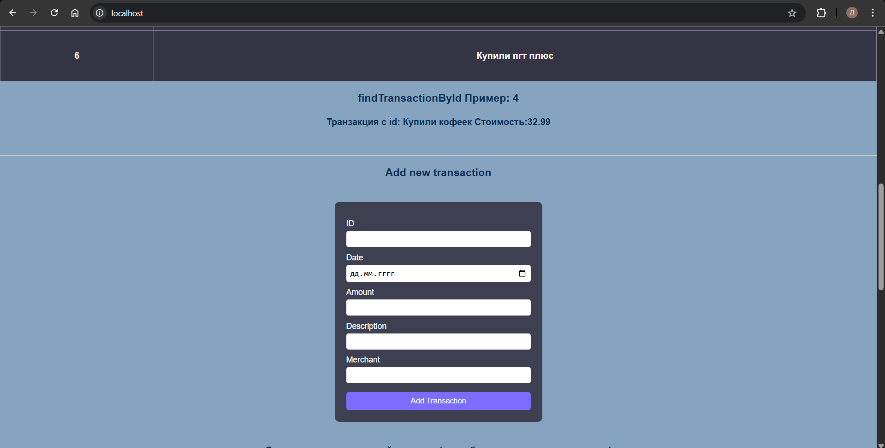
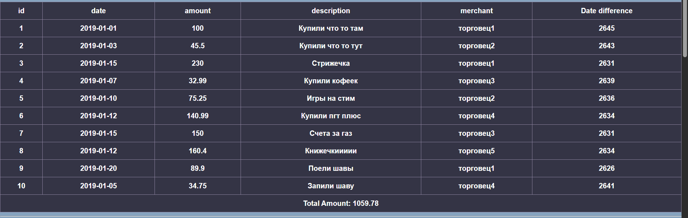

# Лабораторная работа номер 6: Взаимодействие контейнеров

## Цель работы : 
Научиться управлять взаимодействием нескольких контейнеров. Важно! не используем docker-compose.

## Ход работы 

- Создаем в локальной папке компьютера путь `mounts/site`, куда копируем проект с php, разработанный нами ранее.
- Создаем файл `.gitignore ` и записываем туда наш путь, созданный ранее 
```gitignore
mounts/site/*
```
- В корневом каталоге лабораторной работы, создаем новый путь `nginx/default.conf` со следующим содержимым 
```bash
server {
    listen 80;
    server_name _;
    root /var/www/html;
    index index.php;
    location / {
        try_files $uri $uri/ /index.php?$args;
    }
    location ~ \.php$ {
        fastcgi_pass backend:9000;
        fastcgi_index index.php;
        fastcgi_param SCRIPT_FILENAME $document_root$fastcgi_script_name;
        include fastcgi_params;
    }
}
```

Создаем внутреннюю сеть, дабы реализовать взаимодействие между контейнерами
`docker network create  internal `

## Создаем контейнер backend 
Далее создаем и запускаем контейнер на базе образа php:7.4-fpm , контейнеру монтируем директорию mounts/site в /var/www/html, а так же подключаем его к сети internal.

`docker run -d --name backend --network internal -v D:/univer/konteiners/lab06/mounts/site:/var/www/html php:7.4-fpm`

где: 
- `--network internal` -подключение к ранее созданной сети 
- `-v D:/univer/konteiners/lab06/mounts/site:/var/www/html php:7.4-fpm` - монтирование тома mounts/site к контейнеру, то есть делаем доступным файлы в данной директории внутри контейнера по адресу /var/www/html


## Создаем контейнер frontend  

Создаем и запускаем контейнер frontend на базе образа nginx:1.23-alpine, монтируем к контейнеру директорию mounts/site в /var/www/html, а так же файл nginx/default.conf в /etc/nginx/conf.d/default.conf, подключаем 80 порт контейнера к 80 порту хоста, подключаем к сети internal

`docker run -d --name frontend --network internal -p 80:80  -v D:/univer/konteiners/lab06/mounts/site:/var/www/html -v D:/univer/konteiners/lab06/nginx/default.conf:/etc/nginx/conf.d/default.conf nginx:1.23-alpine`


Проверяем работу сайта : 




## Ответы на вопросы: 
- Каким образом в данном примере контейнеры могут взаимодействовать друг с другом?
    - Контейнеры взаимодействуют через созданную нами сеть internal. Мы открываем http://localhost, запрос попадает в nginx, перенаправляет нас в контейнер backend с php-fpm, он отправляет код и отправляет страничку обратно в nginx.
- Как видят контейнеры друг друга в рамках сети internal?
    - Контейнер видят друг друга по именам, это можно увидеть в конфигурационном файле, где мы обращаемся к контейнеру по имени : `fastcgi_pass backend:9000`
- Почему необходимо было переопределять конфигурацию nginx?
    - Так как базовый nginx не умеет работать с php и он бы просто показывал нам файл, а нам необходимо, что бы php выполнялся где то, для этого мы перенаправляем его в php-fpm

## Выводы: 
Данная лабораторная работа показала, что можно не страдать, ведь простое разделение на несколько контейнеров и добавление сети, для их взаимодествия, избавляют нас от мучений, коим мы подвергались в предыдущей лабораторной. 

## Библиография 
- [moodle](https://elearning.usm.md/mod/lesson/view.php?id=284438&pageid=3061)
- [gpt](https://chatgpt.com/)
